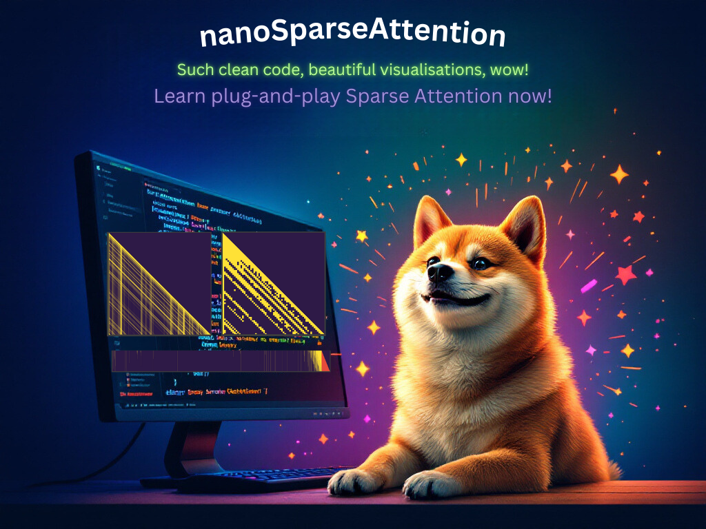

# nanoSparseAttention

<p align="center">
  
</p>

## Overview

nanoSparseAttention provides clean, educational implementations of recent Sparse Attention mechanisms for both prefilling and generation stages of LLM inference. The repository prioritizes clarity and understanding over performance, making it ideal for learning and experimentation.

We implemented a [Jupyter notebook](./notebooks/tutorial.ipynb) that provides:
1. Detailed explanation of Sparse Attention concepts
2. Step-by-step implementation walkthrough
3. Visualization of attention patterns
4. Performance comparisons between different methods

The notebook has been prepared for the purpose of [NeurIPS 2024 Dynamic Sparsity Workshop](https://dynamic-sparsity.github.io/) - check it out if you want to learn more about dynamic execution, not only in the context of self-attention!

### Key Features

- **Pure PyTorch Implementation**: All attention mechanisms are implemented in pure PyTorch for maximum clarity and ease of understanding.
- **Real-world Testing**: Uses Llama-3.2-1B-Instruct model and FiscalNote/billsum dataset for practical experiments.
- **Comprehensive Tutorial**: Includes a detailed Jupyter notebook explaining core concepts and implementations.
- **Extensible Design**: Easy to add new models, datasets, and attention patterns through modular architecture.
- **Flexible Inference**: Supports both prefilling and generation stages with ability to mix both at once.

### Implemented Methods

#### Prefilling Stage
- **Local Window + Attention Sinks** [(Xiao et al, 2023)](https://arxiv.org/abs/2309.17453), [(Han et al, 2024)](https://arxiv.org/abs/2308.16137)
- **Vertical-Slash Attention** [(Jiang et al, 2024)](https://arxiv.org/abs/2407.02490)
- **Block-Sparse Attention** [(Jiang et al, 2024)](https://arxiv.org/abs/2407.02490)

#### Generation Stage
- **Local Window + Attention Sinks** [(Xiao et al, 2023)](https://arxiv.org/abs/2309.17453), [(Han et al, 2024)](https://arxiv.org/abs/2308.16137)
- **SnapKV** [(Li et al, 2024)](https://arxiv.org/abs/2404.14469)
- **TOVA** [(Oren et al, 2023)](https://arxiv.org/abs/2401.06104)

## Installation

Assuming that we want to use Python venv it's as easy as:

```
git clone https://github.com/PiotrNawrot/nano-sparse-attention
cd nano-sparse-attention
python3 -m venv .venv
source .venv/bin/activate
pip install --upgrade pip setuptools wheel psutil
pip install -e ./
```

## Example Usage

The repository provides two main scripts for experimenting with sparse attention mechanisms:

### Prefilling Stage

```python
from nano_sparse_attn.attention import InferenceHandler, DenseAttention, LocalAndSinksAttention
from nano_sparse_attn.utils import load_model_and_tokenizer, load_examples, update_attention, model_forward

# Load model and prepare inputs
model, tokenizer = load_model_and_tokenizer()
model_inputs = load_examples(tokenizer, num_examples=1)

# Create an inference handler with Local Window + Attention Sinks
handler = InferenceHandler(
    prefill_attention=LocalAndSinksAttention(
        window_size=256,
        attention_sinks=16
    ),
    generation_attention=DenseAttention()
)

# Update model's attention mechanism and run forward pass
update_attention(model, handler)
loss = model_forward(model, model_inputs, handler)

# Get information about the attention mechanism
info = handler.info()
print(f"Loss: {loss}")
print(f"Sparsity: {info['prefill']['sparsity']}")
```

### Generation Stage

```python
# Assumes imports from the previous example
from nano_sparse_attn.attention import SnapKVAttention

# Create an inference handler with SnapKV for generation
handler = InferenceHandler(
    prefill_attention=DenseAttention(),
    generation_attention=SnapKVAttention(
        approximation_window=64,
        token_capacity=256
    )
)

# Update model's attention mechanism and run forward pass
update_attention(model, handler)
loss = model_forward(model, model_inputs, handler)

# Get information about the attention mechanism
info = handler.info()
print(f"Loss: {loss}")
print(f"Sparsity: {info['generation']['sparsity']}")
```

For ready-to-use scripts check out [main_prefill.py](./main_prefill.py) and [main_generate.py](./main_generate.py).
For a detailed walkthrough of the repository and information about extending it to new models, datasets, and attention patterns, refer to [this README](./nano_sparse_attn/README.md).

## Contributing

Contributions are welcome! Our goal is to keep this repository up-to-date with the latest Sparse Attention methods, by consistently adding new methods. Feel free to submit a Pull Request if 1) you want a new method to be added or 2) [even better] you have an implementation of a new Sparse Attention method!

## Authors

Piotr Nawrot - [Website](https://piotrnawrot.github.io/) - piotr@nawrot.org

Edoardo Maria Ponti - [Website](https://ducdauge.github.io/) - eponti@ed.ac.uk
